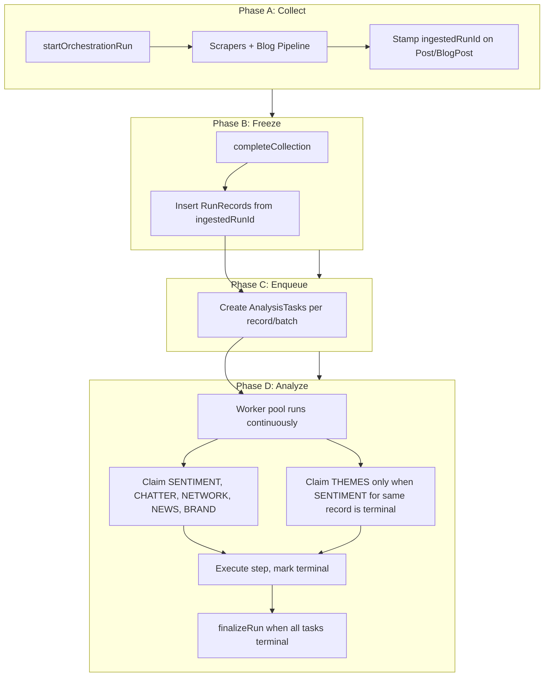

# Analysis Persistent State Redesign

## Design Decisions (from clarifications)

- **Dependencies:** Per-record only. THEMES for post X is runnable when SENTIMENT for post X is terminal (SUCCEEDED/FAILED/SKIPPED). No global waves—worker pool runs continuously; SENTIMENT, CHATTER, NETWORK, NEWS, BRAND can all claim in parallel; THEMES claim query filters to records whose SENTIMENT task is already terminal.
- **News:** One task per batch of N posts (recordKey = batch identifier)
- **Network:** One task per post; worker aggregates by author when executing
- **Collection freeze:** All Post-creating steps (scrapers, blog pipeline) must complete before freezing the run window

---

## Architecture




---

## Phase 0: Preparation (no schema changes)

- Keep [lib/comprehensive-analysis.ts](lib/comprehensive-analysis.ts) and `AnalysisProgress` unchanged
- Add feature flag `USE_TASK_BASED_ANALYSIS` (e.g. in AppConfig or env) to toggle between old and new path

---

## Phase 1: Schema and Ingestion Stamping

### 1.1 Prisma models and migration

Add to [prisma/schema.prisma](prisma/schema.prisma):

**OrchestrationRun**

- `id` (ULID), `project_id`, `orchestration_execution_id` (nullable, links to current OrchestrationExecution)
- `status` enum: `COLLECTING` | `READY_FOR_ANALYSIS` | `ANALYZING` | `COMPLETED` | `COMPLETED_WITH_ERRORS` | `FAILED`
- `started_at`, `collected_at`, `analysis_started_at`, `analysis_completed_at`
- `metadata` Json (optional)
- Indexes: `(project_id, status)`, `(project_id, started_at)`

**RunRecord**

- `id` (ULID), `run_id`, `project_id`, `record_type` enum (`POST` | `BLOG_POST` | `NEWS_BATCH`)
- `record_key` String (Post.id, BlogPost.id, or batch id e.g. `{runId}-batch-{idx}`)
- `source` String?, `created_at`
- Unique `(run_id, record_type, record_key)`
- Indexes: `(run_id)`, `(project_id, record_type)`

**AnalysisTask**

- `id` (ULID), `project_id`, `run_id`, `record_type`, `record_key`, `step` enum
- Steps: `SENTIMENT` | `THEMES` | `CHATTER` | `NETWORK` | `NEWS` | `BRAND` | `BLOG_NEWS_ANALYSIS`
- `state` enum: `PENDING` | `RUNNING` | `SUCCEEDED` | `FAILED` | `SKIPPED`
- `attempt_count` Int default 0, `locked_at` DateTime?, `last_error` String?
- `result_version` Int default 1, `updated_at`, `completed_at`
- Unique `(project_id, record_type, record_key, step, result_version)`
- Indexes: `(project_id, state, step)`, `(run_id, state)`

**Post and BlogPost**

- Add `ingested_run_id` String? (FK to OrchestrationRun.id)
- Index on `(project_id, ingested_run_id)` for freeze query

### 1.2 Stamp ingestedRunId at write sites


| Location                                                                 | Change                                                                                                                                  |
| ------------------------------------------------------------------------ | --------------------------------------------------------------------------------------------------------------------------------------- |
| [lib/apify-service.ts](lib/apify-service.ts) `processAndSavePosts`       | Accept `ingestedRunId?: string`; add to every `prisma.post.upsert` create/update data                                                   |
| [lib/blog-post-analysis-pipeline.ts](lib/blog-post-analysis-pipeline.ts) | Accept `ingestedRunId`; add to Post upsert when creating from ideas; add to BlogPost when creating from discovery                       |
| [lib/orchestration-executor.ts](lib/orchestration-executor.ts)           | Create OrchestrationRun per project at execution start; pass `runId` into StepExecutor; pass to `processAndSavePosts` and blog pipeline |


**Execution flow:**

1. When execution starts (before first step): create one `OrchestrationRun` per `projectId` from orchestration, status=`COLLECTING`
2. StepExecutor receives `runId` per project (map projectId -> runId)
3. Scraper step: pass `runId` into `processAndSavePosts` → stamp `ingested_run_id`
4. Brand Blog step: pass `runId` into `runBlogPostTableAnalysis` → stamp `ingested_run_id` on BlogPost (discovery) and Post (from ideas)

---

## Phase 2: Lifecycle and Enqueue

### 2.1 New module: `lib/analysis-run.ts`

Implement:

- `startOrchestrationRun(projectId, orchestrationExecutionId?)` → create OrchestrationRun, return runId
- `completeCollection(runId)` → set status=`READY_FOR_ANALYSIS`, `collected_at`
- `freezeRunMembership(runId)` → insert RunRecords for all Post/BlogPost where `ingested_run_id=runId`
- `enqueueRunTasks(runId)`:
  - For each RunRecord with `record_type=POST`: create AnalysisTask for SENTIMENT, THEMES, CHATTER, NETWORK, BRAND (ON CONFLICT DO NOTHING)
  - Group POST RunRecords into batches of 20 (or configurable); for each batch create one RunRecord `record_type=NEWS_BATCH`, `record_key={runId}-batch-{idx}`; create one AnalysisTask step=NEWS per batch
  - For each RunRecord with `record_type=BLOG_POST`: create AnalysisTask step=BLOG_NEWS_ANALYSIS
- `startRunAnalysis(runId)` → set status=`ANALYZING`, `analysis_started_at`
- `finalizeRun(runId)` → if any FAILED then `COMPLETED_WITH_ERRORS` else `COMPLETED`; set `analysis_completed_at`
- `isRunComplete(runId)` → all tasks terminal (SUCCEEDED/FAILED/SKIPPED)

### 2.2 Orchestration completion hook

When execution completes (and `USE_TASK_BASED_ANALYSIS` is on):

1. For each projectId: find OrchestrationRun with status=COLLECTING and matching execution
2. Call `completeCollection(runId)`, `freezeRunMembership(runId)`, `enqueueRunTasks(runId)`, `startRunAnalysis(runId)`
3. Run worker loop until `isRunComplete(runId)` for all runs
4. Call `finalizeRun(runId)` for each

---

## Phase 3: Workers and Step Executors

### 3.1 Task claiming

```typescript
async function claimTasks(projectId: string, runId: string, step: Step, limit: number): Promise<AnalysisTask[]>
```

- Use raw SQL or Prisma `$queryRaw` for `SELECT ... FOR UPDATE SKIP LOCKED` (SQLite: `SELECT ... WHERE state='PENDING' LIMIT ?` and update in transaction; Postgres supports SKIP LOCKED)
- Update state=RUNNING, locked_at=now(), attempt_count+=1
- Return claimed tasks

**Per-record dependency for THEMES:** When step=THEMES, the claim query must additionally require that the SENTIMENT task for the same (project_id, record_type, record_key, result_version) is terminal (state in SUCCEEDED, FAILED, SKIPPED). Use a subquery or JOIN to filter: only claim THEMES tasks where the corresponding SENTIMENT task exists and has terminal state.

### 3.2 Continuous worker pool (no global waves)

- Worker pool runs continuously, claiming PENDING tasks from any step
- For steps SENTIMENT, CHATTER, NETWORK, NEWS, BRAND: claim normally (state=PENDING)
- For step THEMES: claim only when SENTIMENT for same (recordType, recordKey, resultVersion) is terminal
- This preserves correctness (themes uses sentiment) without serializing the entire run
- Improves throughput and time-to-first-results (e.g. themes for post 1 can run while sentiment for post 50 is still running)

### 3.3 Step executors (extract from existing comprehensive-analysis)

Refactor into standalone functions that accept (projectId, task, context):


| Step               | Input                     | Output                           | Notes                                                                                          |
| ------------------ | ------------------------- | -------------------------------- | ---------------------------------------------------------------------------------------------- |
| SENTIMENT          | Post id(s) from recordKey | Update Post.sentiment            | Single post per task                                                                           |
| THEMES             | Post id                   | Theme matches                    | Single post                                                                                    |
| CHATTER            | Root post id (recordKey)  | ChatterAnalysis record           | Build thread from replies; worker aggregates by root                                           |
| NETWORK            | Post id                   | NetworkAnalysis (by author)      | One task per post; worker loads thread, identifies person, upserts by author                   |
| NEWS               | Batch recordKey           | PostNews records                 | Load batch of post ids from RunRecord batch; call existing synthesizeNews logic for that batch |
| BRAND              | Post id                   | BrandAnalysis                    | Single post                                                                                    |
| BLOG_NEWS_ANALYSIS | BlogPost id               | BlogNewsAnalysis + derived Posts | Call existing blog idea extraction for that BlogPost                                           |


**Idempotency:** Upsert by (recordType, recordKey, step, resultVersion). For multi-row outputs (themes, news items), delete+insert within transaction keyed by that tuple, or upsert with deterministic keys.

### 3.4 News batch handling

- RunRecord for NEWS_BATCH has record_key like `{runId}-batch-0`
- A separate table or JSON in RunRecord could store post ids in batch; or derive from RunRecords: batch 0 = posts 0-19, batch 1 = 20-39, etc. (order by id)
- News worker: load post ids for this batch, call `analyzeNewsInBatch`-style logic, write PostNews with `run_id`, `result_version`

---

## Phase 4: Rerun Endpoints

Add API routes:

1. **POST /api/projects/[projectId]/analysis/rerun** – targeted rerun by records + steps, modes: RESET, NEW_VERSION, FORCE
2. **POST /api/runs/[runId]/analysis/retryFailed** – set all FAILED tasks to PENDING
3. **POST /api/runs/[runId]/analysis/rerunStep** – reset or NEW_VERSION for a whole step

Implement in [app/api/](app/api/) with server actions or route handlers.

---

## Phase 5: Result Traceability (optional)

Add to output tables (Post sentiment, ThemeMatch, PostNews, NetworkAnalysis, etc.):

- `record_type`, `record_key`, `step`, `result_version`, `run_id`

Upsert keys include these for idempotent reruns.

---

## Phase 6: Cutover and Deprecation

1. Feature flag `USE_TASK_BASED_ANALYSIS=true` for selected projects or globally
2. When on: orchestration uses new path; `runComprehensiveAnalysis` is not called
3. When stable: remove cursor logic, `AnalysisProgress` (or archive)
4. Remove feature flag

---

## File Summary


| File                                                   | Changes                                                                                       |
| ------------------------------------------------------ | --------------------------------------------------------------------------------------------- |
| `prisma/schema.prisma`                                 | Add OrchestrationRun, RunRecord, AnalysisTask; add ingested_run_id to Post, BlogPost          |
| `lib/analysis-run.ts`                                  | New: lifecycle, freeze, enqueue, finalize                                                     |
| `lib/analysis-worker.ts`                               | New: claimTasks with per-record dependency for THEMES, continuous worker pool, step executors |
| `lib/orchestration-executor.ts`                        | Create OrchestrationRun at start; pass runId to steps; on completion call new path if flag on |
| `lib/apify-service.ts`                                 | Add ingestedRunId param, stamp in Post upserts                                                |
| `lib/blog-post-analysis-pipeline.ts`                   | Add ingestedRunId param, stamp in BlogPost and Post                                           |
| `app/api/projects/[projectId]/analysis/rerun/route.ts` | New                                                                                           |
| `app/api/runs/[runId]/analysis/retryFailed/route.ts`   | New                                                                                           |
| `app/api/runs/[runId]/analysis/rerunStep/route.ts`     | New                                                                                           |


---

## Migration Order

1. Add schema + migrate
2. Add ingestedRunId to Post/BlogPost; backfill null for existing rows
3. Update apify-service and blog pipeline to accept and stamp ingestedRunId (no-op when null)
4. Implement analysis-run and workers behind flag
5. Wire orchestration to new path when flag on
6. Test, then cutover and deprecate old path

